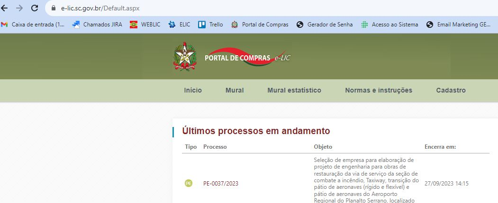
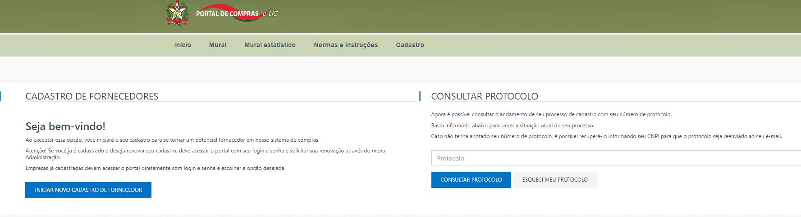
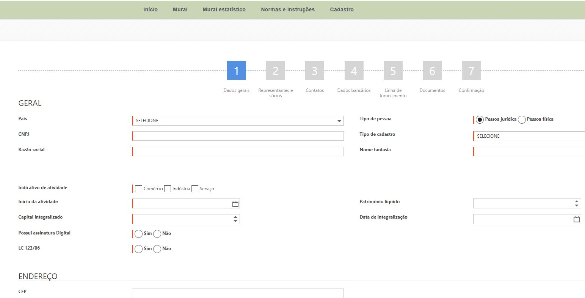
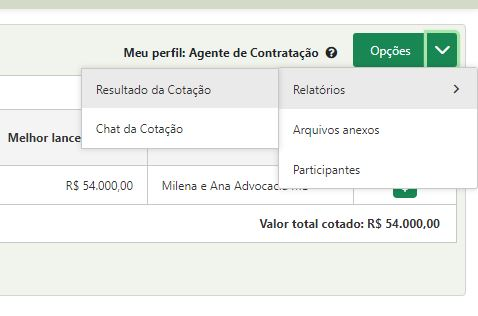

# 2 - Entendendo o Cadastro Externo

O objetivo do “Cadastro Externo” é proporcionar que efetue cadastro no Portal, do qual as empresas fornecedoras deverão incluir suas informações, visando participar de processos de compras mediante análise dos dados pela empresa compradora. Para isso as principais atividades ou funcionalidades para o fornecedor serão divididas e detalhadas nos seguintes tópicos: 2.1. Funcionalidades

2.1. Funcionalidades da Tela Inicial de Cadastro&#x20;

2.2. Cadastrando a etapa de Dados Gerais

&#x20;2.3. Cadastrando a etapa de Representantes e Sócios&#x20;

2.4. Cadastrando a etapa de Contatos&#x20;

2.5. Cadastrando a etapa de Dados Bancários

&#x20;2.6. Cadastrando a etapa de Linha de Fornecimento

&#x20;2.7. Cadastrando a etapa de Documentos&#x20;

2.8. Cadastrando a etapa de Áreas de atuação

&#x20;2.9. Cadastrando a etapa de Profissionais

&#x20;2.10. Cadastrando a etapa de Editais de Credenciamento&#x20;

2.11. Confirmação&#x20;

Acesse o site [https://e-lic.sc.gov.br/](https://e-lic.sc.gov.br/) para iniciar o seu cadastro no Portal de Compras. Deve-se clicar na opção “Cadastro”.

<figure><figcaption></figcaption></figure>

### 2.1. Funcionalidades da Tela Inicial de Cadastro&#x20;

(Passo 1) Ao acessar a tela de “Cadastro” abrirá a tela que permite verificar as ações: “Iniciar Novo Cadastro de Fornecedor”, “Consultar Protocolo” e “Esqueci meu protocolo”:

<figure><figcaption></figcaption></figure>

### 2.2. Cadastrando a Etapa de Dados Gerais

(Passo 1) Os “Dados Gerais” são informações básicas do cadastro da empresa fornecedora. Ao selecionar a opção “Iniciar Novo Cadastro de Fornecedor”, deve-se preencher os dados da empresa, sendo que os campos com destaque em vermelho são campos “Obrigatórios” solicitados pela empresa compradora, e de importância para análise de seu cadastro.

<figure><figcaption></figcaption></figure>

&#x20;(Passo 2) Para os casos em que a empresa já seja fornecedora do portal de compras, o sistema não permitirá um novo cadastro. Nessa situação já existe um cadastro homologado e não será possível fazer um novo cadastro, apenas de realizar as funções de “Atualização Cadastral” ou “Renovação Cadastral”.

\

<figure><figcaption></figcaption></figure>

Figura 4. Mensagem de alerta caso o CNPJ já seja cadastrado no portal

\
(Passo 3) Inicialmente no primeiro grupo serão apresentados campos “Obrigatórios” como “País”, “Tipo de Pessoa: Física ou Jurídica”. O segundo campo irá determinar o grupo de cadastro que será habilitado ao ser selecionado. Caso seja “Pessoa Jurídica”, habilitará os campos de “CNPJ”, “Razão Social”, “Nome Fantasia” e “Tipo de Cadastro: Completo ”, todos campos sendo “Obrigatórios”.

<figure><figcaption></figcaption></figure>

(Passo 4) Caso seja selecionado “Pessoa Física” é necessário preencher os campos “Obrigatórios”: “CPF”, “Nome” e “Tipo de Cadastro: Completo e Simplificado”, após opcionalmente poderá ser preenchido os campos seguintes: “Data de Nascimento”, “Local de Nascimento”, “RG”, “Profissão” e “PIS/PASEP”.

<figure><figcaption></figcaption></figure>

&#x20;(Passo 5) Caso seja selecionado “Pessoa Física” é necessário preencher os campos “Obrigatórios”: “CPF”, “Nome” e “Tipo de Cadastro: Completo, Intermediário, Pessoa Física ou Simplificado”, “RG” “PIS/PASEP”, após opcionalmente poderá ser preenchido os campos seguintes: “Data de Nascimento”, “Local de Nascimento” e “Profissão”.

&#x20;

<figure><figcaption></figcaption></figure>

(Passo 6) Abaixo será detalhado o segundo grupo de preenchimento da etapa de “Dados Gerais”, caso seja selecionado a opção de “Tipo de Pessoa: Jurídica”. Figura 8. Segundo grupo de preenchimento dos dados gerais. • “Indicativo de Atividade”: Campo “Obrigatório” que deve ser selecionado o foco da atividade da empresa: “Comércio”, “Indústria” ou “Serviço”. Figura 9. Campo indicativo da atividade dos dados gerais. • “Início da Atividade”: Campo “Obrigatório” que pode ser configurado como deve ser informado a data inicial da atividade na empresa. Figura 10. Campo início da atividade dos dados gerais. 9 www.paradigmabs.com.br • “Capital Integralizado”: Campo que pode ser configurado para “Obrigatório” ou opcional e que deve informar o valor integralizado na empresa. A integralização de capital pode se dar não apenas na forma de investimento de dinheiro, mas também na disposição de bens, como máquinas, automóveis ou imóveis. A integralização de capital deve seguir o que foi anteriormente acordado entre os sócios por meio de documento específico, redigido sob a orientação de um advogado ou profissional de contabilidade. Figura 11. Campo de capital integralizado dos dados gerais. • “Possui assinatura digital”: Caso a empresa possua a “Assinatura Digital” ou Certificação digital é necessário selecionar a opção “Sim” ou “Não”. Figura 12. Campo possui assinatura digital. • “LC 123/06?”: É necessário selecionar “Sim” ou “Não”, caso a empresa se enquadre dentro da lei 123/06 (A empresa está registrada como microempresa ou empresa de pequeno porte). Figura 13. Campo lei 123/06 dos dados gerais • “Patrimônio Líquido”: O “Patrimônio Líquido” ou Capital Próprio representa os valores que os sócios ou acionistas têm na empresa em um determinado momento, sendo um campo opcional para ser preenchido. • “Data de Integralização”: Campo que pode ser configurado como “Obrigatório” ou opcional e que deve informar a “Data de Integralização”, isso significa que houve, por meio do contrato social ou de uma assembleia geral extraordinária, a promessa de integralização de capitais em uma determinada data. A partir do momento que esse capital subscrito é efetivamente integralizado, ele passa a ser chamado de capital integralizado. Figura 14. Campo de data de integralização dos dados gerais. 10 www.paradigmabs.com.br (Passo 7) Após ser inserido os dados dos blocos “Geral”, “Dados Complementares”, “Endereço” e “Contato” da etapa de “Dados Gerais”. Deve-se clicar no botão “Continuar” para seguir com as seguintes etapas do cadastro. Figura 15. Tela de cadastro de dados complementares e endereço dos dados gerais. NOTA 1 : Toda os blocos de cadastro citados se fazem necessário preencher os dados “Obrigatórios” para continuar os cadastros nas próximas etapas. NOTA 2 : No Campo “CEP” , ele faz validação de CEP junto aos correios, trazendo informações como logradouro, bairro, município e estado, facilitando o preenchimento e garantindo as informações digitadas. Essa atualização está disponível somente a partir da versão 7.43 e essa funcionalidade somente poderá ser aplicada para cliente que possuem contrato com os correios e acesso a consulta de CEP. Figura 16. Função para continuar para a próxima etapa de cadastro externo. (Passo 8) Logo após o preenchimento da etapa “Dados Gerais” deve-se clicar na opção “Continuar”, o usuário da empresa fornecedora receberá um protocolo, para que possa realizar eventuais pesquisas na “Consulta de Protocolo”. 11 www.paradigmabs.com.br Figura 17. Recebimento de protocolo por e-mail.










