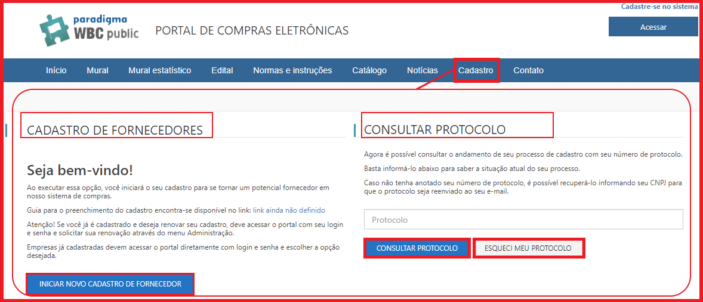

# 2 - Entendendo o Cadastro Externo

O objetivo do “Cadastro Externo” é proporcionar que efetue cadastro no Portal, do qual as empresas fornecedoras deverão incluir suas informações, visando participar de processos de compras mediante análise dos dados pela empresa compradora. Para isso as principais atividades ou funcionalidades para o fornecedor serão divididas e detalhadas nos seguintes tópicos: 2.1. Funcionalidades

2.1. Funcionalidades da Tela Inicial de Cadastro&#x20;

2.2. Cadastrando a etapa de Dados Gerais

&#x20;2.3. Cadastrando a etapa de Representantes e Sócios&#x20;

2.4. Cadastrando a etapa de Contatos&#x20;

2.5. Cadastrando a etapa de Dados Bancários

&#x20;2.6. Cadastrando a etapa de Linha de Fornecimento

&#x20;2.7. Cadastrando a etapa de Documentos&#x20;

2.8. Cadastrando a etapa de Áreas de atuação

&#x20;2.9. Cadastrando a etapa de Profissionais

&#x20;2.10. Cadastrando a etapa de Editais de Credenciamento&#x20;

2.11. Confirmação&#x20;

(Passo 1) A partir desta tela inicial do sistema, poderá identificar os passos para iniciar o seu cadastro no Portal de Compras. Deve-se clicar na opção destacado: “Cadastro”.

<figure><figcaption></figcaption></figure>

**Na área que apresenta o resumo do pregão, o usuário pode ver:**&#x20;

* Quantidade de propostas recebidas;&#x20;
* Número de Fornecedores que enviaram propostas;&#x20;
* Quantidade de propostas canceladas;&#x20;
* Impugnações registradas contra o edital, bem como sua situação: sem parecer, deferido ou indeferido.

.png>)

O sistema permite realizar uma série de intervenções no processo do pregão eletrônico, quais sejam:&#x20;

* Suspender o pregão;&#x20;
* Cancelar o pregão;&#x20;
* Revogar o pregão;&#x20;
* Reativar um pregão suspenso ou interrompido;&#x20;
* Anular o pregão;&#x20;
* Prorrogar o pregão.

Cada uma destas funções pode ser encontrada no painel de controle da tela de acompanhamento do pregão eletrônico.&#x20;

**NOTA**: É importante observar que estas funcionalidades variam, de acordo com a etapa do processo.

<figure><figcaption></figcaption></figure>

**Observação sobre mensagem de ALERTA para usuário fornecedor durante envio de proposta para itens/lotes de cotas.**&#x20;

O sistema faz verificação do porte da empresa no momento do envio de propostas e disputa de lances de item ou lote que fazem parte de cota **PRINCIPAL, RESERVADA E EXCLUSIVA.**&#x20;

Só permite proposta / lances para os itens da cota reservada ou exclusiva de fornecedores categorizados como **MEIs, MEs e EPPs** para efetivamente atender à legislação vigente.

{% embed url="https://www.youtube.com/watch?ab_channel=DiretoriadeGest%C3%A3odeLicita%C3%A7%C3%B5eseContratos&v=wo_NcnMCk4s" %}
