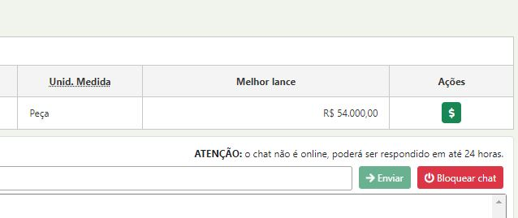

# 3 - Desclassificar um Lance

Para desclassificar um lance primeiro clique no botão $

<figure><figcaption></figcaption></figure>

Em seguida no botão vermelho

<figure><figcaption></figcaption></figure>

