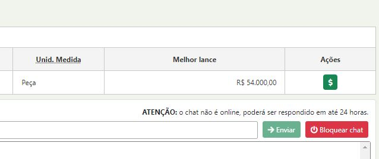

# 3 - Inativar um Lance

Para inativar um lance clique no botão $

<figure><figcaption></figcaption></figure>

<figure><figcaption></figcaption></figure>

<figure><figcaption></figcaption></figure>

* **Passo 04:** Clicar no botão “Abrir proposta(s)” para analisar as propostas recebidas dos fornecedores.&#x20;
* **Passo 05:** Clicar no botão <mark style="color:red;">**“OK”**</mark> para confirmar a operação.

<figure><figcaption></figcaption></figure>

Ao executar esta ação e o sistema constatar que não foram enviadas propostas para o pregão eletrônico, será exibida uma mensagem na tela, conforme demonstrado na figura abaixo.&#x20;

* **Passo 06:** Clicar no botão <mark style="color:red;">**“OK”.**</mark>

<figure><figcaption></figcaption></figure>

A situação do pregão eletrônico será alterada para **“Deserto”**, conforme demonstrado na figura abaixo:

<figure><figcaption></figcaption></figure>
