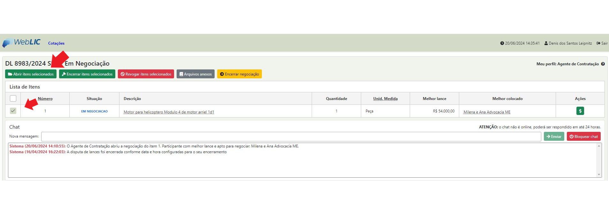

# 7 - Encerramento da Disputa de Lances - Abrir os itens para negociação

* **Passo 01:** Clicar no botão <mark style="color:red;">**“Abrir itens selecionados”**</mark> para iniciar a negociação

<figure><figcaption></figcaption></figure>

* **Passo 02:** Iniciar a negociação através do CHAT

<figure><figcaption></figcaption></figure>

