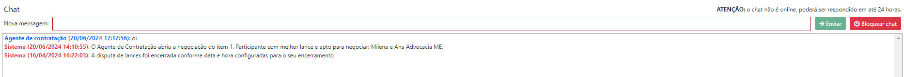

# 7 - Encerramento da Disputa de Lances - Abrir os itens para negociação

Encerrada a etapa de disputa de lances, o Agente de Contratação deverá abrir os itens para negociação, junto ao(s) fornecedor(es) melhore(s) colocados do processo.

Clicar no botão <mark style="color:red;">**“Abrir itens selecionados”**</mark> para iniciar a negociação

<figure><figcaption></figcaption></figure>

* Iniciar a negociação através do CHAT

<figure><figcaption></figcaption></figure>

