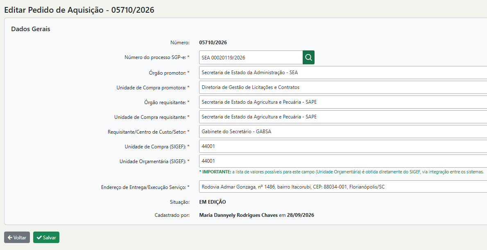

# Como fazer uma PA de Itens de Compra Compartilhada.

Com a centralização das compras, os órgãos deverão registrar seus pedidos de aquisição no sistema, informando a Secretaria de Estado da Administração (SEA) como Órgão Promotor e o órgão interessado na aquisição como Órgão Requisitante.

<figure><figcaption></figcaption></figure>

Veja no vídeo abaixo como fazer um pedido de aquição:



Após fazer o pedido de aquisição a central de compras da SEA, dará procedimento a requisição,  pregão eletrônico até a homologação final da compra.

